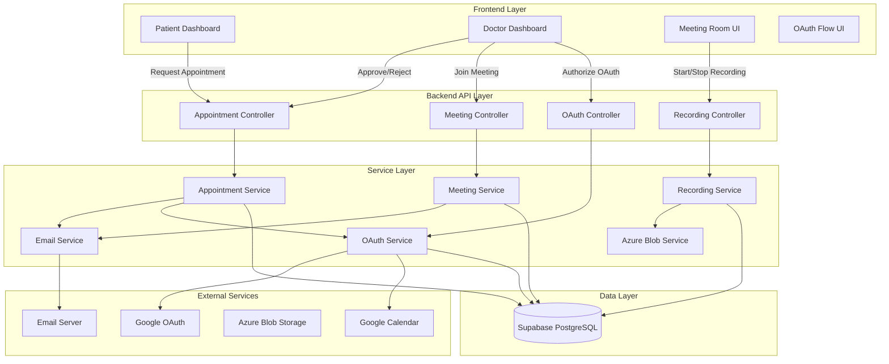
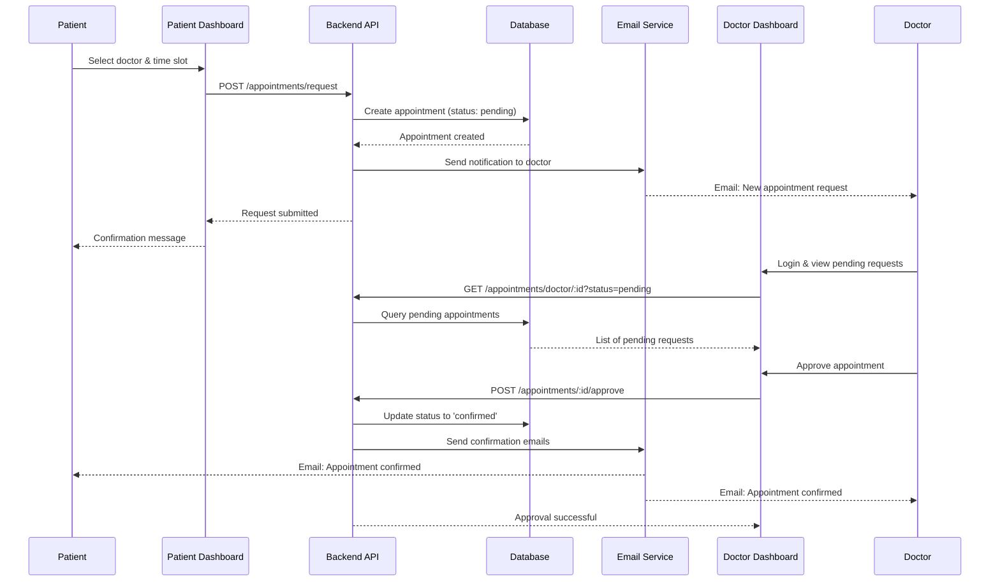
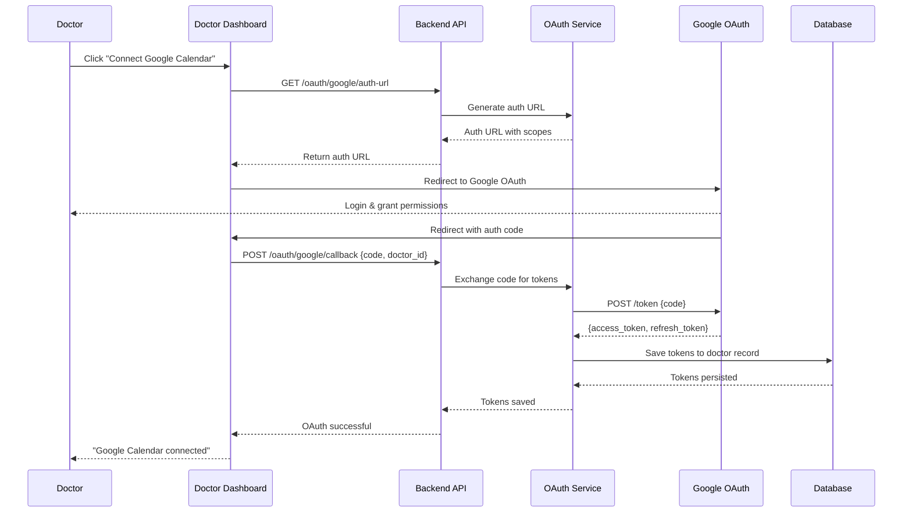
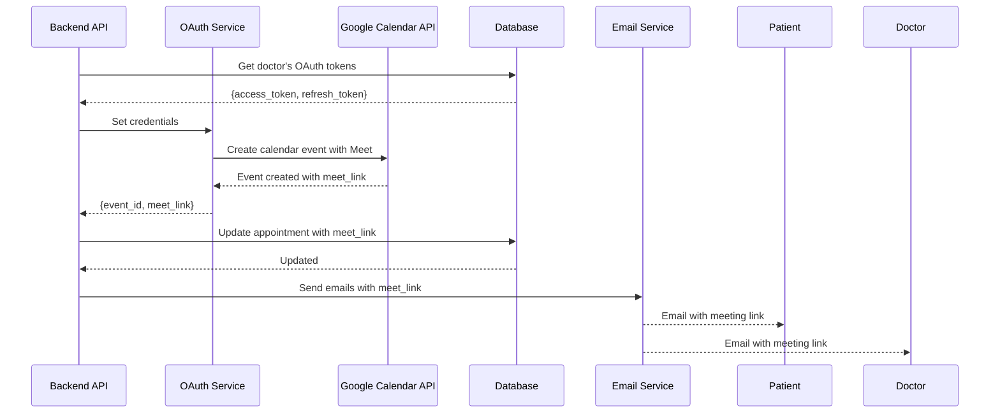
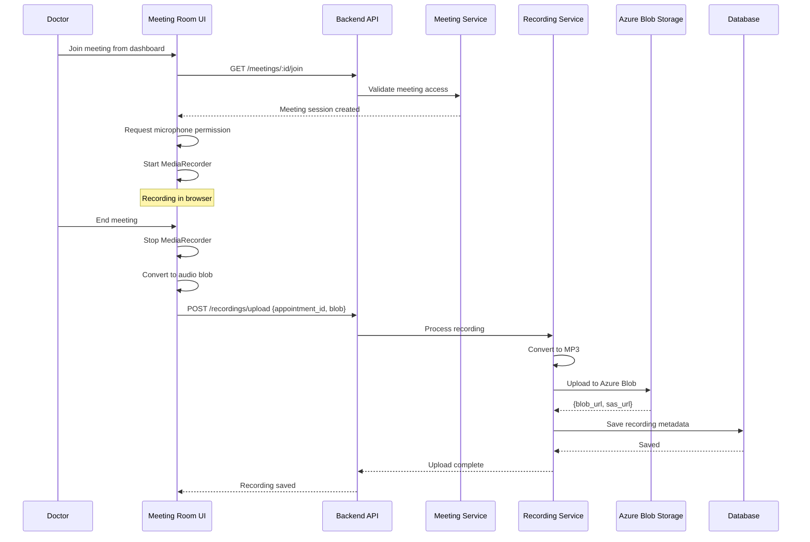

# Design Document: Appointment Booking and Meeting Management System

## Overview

This design document outlines a comprehensive appointment booking and meeting management system that enables patients to request appointments, doctors to approve/reject requests, and facilitates browser-based telehealth meetings with automatic recording capabilities. The system integrates OAuth for calendar synchronization, email notifications for all stakeholders, and secure recording storage in Azure Blob Storage. The architecture builds upon the existing Node.js/Express backend and React/TypeScript frontend, extending the current appointment system with enhanced meeting management, browser-based recording, and OAuth token persistence.

## Architecture

The system follows a layered architecture with clear separation between presentation, business logic, and data layers. The frontend communicates with the backend via RESTful APIs, while the backend orchestrates multiple services including OAuth providers, email delivery, meeting infrastructure, and cloud storage.



## Main Workflow Sequence Diagrams

### Appointment Request and Approval Flow



### OAuth Configuration and Token Persistence Flow



### Calendar Scheduling and Meeting Link Generation Flow



### Browser-Based Meeting and Recording Flow



## Components and Interfaces

### Component 1: Appointment Request Manager

**Purpose**: Handles appointment request creation, approval/rejection workflow, and status management

**Interface**:
```typescript
interface AppointmentRequestManager {
  createRequest(request: AppointmentRequest): Promise<Appointment>
  getPendingRequests(doctorId: string): Promise<Appointment[]>
  approveRequest(appointmentId: string, doctorId: string): Promise<Appointment>
  rejectRequest(appointmentId: string, doctorId: string, reason: string): Promise<Appointment>
  getRequestStatus(appointmentId: string): Promise<AppointmentStatus>
}
```

**Responsibilities**:
- Validate appointment request data
- Create appointment records with 'pending' status
- Query pending appointments for doctor dashboard
- Update appointment status on approval/rejection
- Trigger email notifications on status changes


### Component 2: OAuth Token Manager

**Purpose**: Manages OAuth authorization flow, token exchange, token persistence, and token refresh

**Interface**:
```typescript
interface OAuthTokenManager {
  generateAuthUrl(scopes: string[]): string
  exchangeCodeForTokens(code: string): Promise<OAuthTokens>
  saveTokens(doctorId: string, tokens: OAuthTokens): Promise<void>
  getTokens(doctorId: string): Promise<OAuthTokens | null>
  refreshTokens(doctorId: string): Promise<OAuthTokens>
  revokeTokens(doctorId: string): Promise<void>
}
```

**Responsibilities**:
- Generate OAuth authorization URLs with required scopes
- Exchange authorization codes for access/refresh tokens
- Persist tokens securely in database (encrypted)
- Retrieve tokens for API calls
- Automatically refresh expired access tokens
- Handle token revocation

### Component 3: Calendar Scheduler

**Purpose**: Integrates with Google Calendar API to create, update, and manage calendar events

**Interface**:
```typescript
interface CalendarScheduler {
  createEvent(appointment: Appointment, tokens: OAuthTokens): Promise<CalendarEvent>
  updateEvent(eventId: string, updates: Partial<Appointment>): Promise<CalendarEvent>
  deleteEvent(eventId: string): Promise<void>
  getEvent(eventId: string): Promise<CalendarEvent>
  listEvents(startDate: Date, endDate: Date): Promise<CalendarEvent[]>
}
```

**Responsibilities**:
- Create calendar events with Google Meet links
- Set event attendees (doctor and patient)
- Configure event reminders
- Update event details when appointments change
- Delete events when appointments are cancelled
- Sync appointment data with calendar

### Component 4: Email Notification Service

**Purpose**: Sends email notifications for appointment lifecycle events

**Interface**:
```typescript
interface EmailNotificationService {
  sendAppointmentRequest(to: string, appointment: Appointment): Promise<EmailResult>
  sendAppointmentConfirmation(to: string, appointment: Appointment, meetLink: string): Promise<EmailResult>
  sendAppointmentRejection(to: string, appointment: Appointment, reason: string): Promise<EmailResult>
  sendMeetingReminder(to: string, appointment: Appointment, meetLink: string): Promise<EmailResult>
  sendRecordingReady(to: string, appointment: Appointment, recordingUrl: string): Promise<EmailResult>
}
```

**Responsibilities**:
- Format email templates with appointment details
- Send emails via SMTP service
- Include meeting links in confirmation emails
- Handle email delivery failures gracefully
- Log email delivery status


### Component 5: Meeting Room Manager

**Purpose**: Manages browser-based meeting sessions and WebRTC connections

**Interface**:
```typescript
interface MeetingRoomManager {
  createMeetingSession(appointmentId: string): Promise<MeetingSession>
  joinMeeting(appointmentId: string, userId: string, userType: 'doctor' | 'patient'): Promise<MeetingSession>
  endMeeting(sessionId: string): Promise<void>
  getMeetingStatus(appointmentId: string): Promise<MeetingStatus>
  validateMeetingAccess(appointmentId: string, userId: string): Promise<boolean>
}
```

**Responsibilities**:
- Create meeting sessions for confirmed appointments
- Validate user access to meetings
- Track meeting participants
- Manage meeting lifecycle (active, ended)
- Provide meeting metadata to frontend

### Component 6: Browser Recording Service

**Purpose**: Handles browser-based audio/video recording using MediaRecorder API

**Interface**:
```typescript
interface BrowserRecordingService {
  startRecording(stream: MediaStream): Promise<RecordingSession>
  stopRecording(sessionId: string): Promise<Blob>
  pauseRecording(sessionId: string): Promise<void>
  resumeRecording(sessionId: string): Promise<void>
  getRecordingStatus(sessionId: string): RecordingStatus
}
```

**Responsibilities**:
- Initialize MediaRecorder with appropriate codecs
- Capture audio/video streams from browser
- Handle recording state transitions
- Generate recording blobs
- Handle browser permission requests

### Component 7: Recording Storage Service

**Purpose**: Processes, converts, and stores meeting recordings in Azure Blob Storage

**Interface**:
```typescript
interface RecordingStorageService {
  uploadRecording(file: Buffer, metadata: RecordingMetadata): Promise<StorageResult>
  convertToMP3(audioBlob: Blob): Promise<Buffer>
  generateSasUrl(blobName: string, expiryHours: number): Promise<string>
  deleteRecording(blobName: string): Promise<void>
  getRecordingMetadata(blobName: string): Promise<RecordingMetadata>
}
```

**Responsibilities**:
- Convert recordings to MP3 format
- Upload recordings to Azure Blob Storage
- Generate time-limited SAS URLs for access
- Store recording metadata in database
- Handle upload failures with retry logic
- Clean up temporary files


## Data Models

### Model 1: Appointment

```typescript
interface Appointment {
  appointment_id: string          // UUID
  doctor_id: string               // UUID reference to doctors table
  patient_id: string              // UUID reference to patients table
  appointment_date: Date          // Scheduled date and time
  duration_minutes: number        // Default: 30
  appointment_type: AppointmentType
  status: AppointmentStatus
  reason?: string                 // Patient's reason for appointment
  notes?: string                  // Additional notes
  cancelled_reason?: string       // Reason if cancelled
  consultation_id?: string        // UUID reference to consultations table
  meet_link?: string              // Google Meet link for telehealth
  calendar_event_id?: string      // Google Calendar event ID
  reminder_sent: boolean          // Default: false
  reminder_sent_at?: Date
  created_at: Date
  updated_at: Date
}

type AppointmentType = 
  | 'in_person' 
  | 'telehealth' 
  | 'follow_up' 
  | 'emergency' 
  | 'routine_checkup'

type AppointmentStatus = 
  | 'pending'      // Awaiting doctor approval
  | 'scheduled'    // Approved but not yet started
  | 'confirmed'    // Confirmed with meeting link
  | 'in_progress'  // Meeting is active
  | 'completed'    // Meeting ended
  | 'cancelled'    // Cancelled by doctor or patient
  | 'no_show'      // Patient didn't attend
```

**Validation Rules**:
- appointment_date must be in the future
- duration_minutes must be between 15 and 120
- doctor_id and patient_id must reference existing records
- status transitions must follow valid workflow
- meet_link required when appointment_type is 'telehealth' and status is 'confirmed'

### Model 2: OAuthTokens

```typescript
interface OAuthTokens {
  token_id: string                // UUID
  doctor_id: string               // UUID reference to doctors table
  provider: 'google'              // OAuth provider
  access_token: string            // Encrypted access token
  refresh_token: string           // Encrypted refresh token
  token_type: string              // Usually 'Bearer'
  expires_at: Date                // Token expiration timestamp
  scope: string[]                 // Granted scopes
  created_at: Date
  updated_at: Date
}
```

**Validation Rules**:
- access_token and refresh_token must be encrypted at rest
- expires_at must be validated before API calls
- Tokens must be refreshed when expired
- Only one active token set per doctor per provider

### Model 3: MeetingSession

```typescript
interface MeetingSession {
  session_id: string              // UUID
  appointment_id: string          // UUID reference to appointments table
  doctor_id: string               // UUID
  patient_id: string              // UUID
  status: MeetingStatus
  started_at: Date
  ended_at?: Date
  duration_seconds?: number
  recording_enabled: boolean
  recording_blob_name?: string    // Azure Blob Storage reference
  participants: Participant[]
  created_at: Date
  updated_at: Date
}

type MeetingStatus = 
  | 'waiting'      // Waiting for participants
  | 'active'       // Meeting in progress
  | 'ended'        // Meeting completed
  | 'cancelled'    // Meeting cancelled

interface Participant {
  user_id: string
  user_type: 'doctor' | 'patient'
  joined_at: Date
  left_at?: Date
}
```

**Validation Rules**:
- Only doctor and patient from appointment can join
- Meeting can only start if appointment status is 'confirmed'
- ended_at must be after started_at
- duration_seconds calculated from started_at and ended_at


### Model 4: Recording

```typescript
interface Recording {
  recording_id: string            // UUID
  appointment_id: string          // UUID reference to appointments table
  session_id: string              // UUID reference to meeting_sessions table
  doctor_id: string               // UUID
  patient_id: string              // UUID
  blob_name: string               // Azure Blob Storage blob name
  blob_url: string                // Full blob URL
  sas_url?: string                // Time-limited SAS URL
  sas_expires_at?: Date           // SAS URL expiration
  file_size_bytes: number
  duration_seconds: number
  format: 'mp3' | 'webm' | 'wav'
  status: RecordingStatus
  uploaded_at: Date
  created_at: Date
  updated_at: Date
}

type RecordingStatus = 
  | 'processing'   // Being converted/uploaded
  | 'ready'        // Available for access
  | 'failed'       // Upload/processing failed
  | 'deleted'      // Soft deleted
```

**Validation Rules**:
- blob_name must be unique
- file_size_bytes must be positive
- duration_seconds must match meeting duration
- sas_url must be regenerated when expired
- Recording can only be deleted by doctor or system admin

### Model 5: CalendarEvent

```typescript
interface CalendarEvent {
  event_id: string                // Google Calendar event ID
  appointment_id: string          // UUID reference to appointments table
  summary: string                 // Event title
  description: string             // Event description
  start_time: Date
  end_time: Date
  meet_link: string               // Google Meet link
  attendees: Attendee[]
  reminders: Reminder[]
  status: 'confirmed' | 'cancelled'
  created_at: Date
  updated_at: Date
}

interface Attendee {
  email: string
  display_name: string
  response_status: 'accepted' | 'declined' | 'tentative' | 'needsAction'
}

interface Reminder {
  method: 'email' | 'popup'
  minutes_before: number
}
```

**Validation Rules**:
- start_time must be before end_time
- meet_link must be valid Google Meet URL
- attendees must include doctor and patient emails
- Event must be synced with appointment changes

## Algorithmic Pseudocode

### Main Processing Algorithm: Appointment Approval with Calendar Integration

```typescript
ALGORITHM approveAppointmentRequest(appointmentId, doctorId)
INPUT: appointmentId of type UUID, doctorId of type UUID
OUTPUT: result of type AppointmentApprovalResult

BEGIN
  ASSERT appointmentExists(appointmentId) = true
  ASSERT doctorOwnsAppointment(appointmentId, doctorId) = true
  
  // Step 1: Retrieve appointment and validate status
  appointment ← getAppointmentById(appointmentId)
  ASSERT appointment.status = 'pending'
  
  // Step 2: Retrieve OAuth tokens for calendar integration
  tokens ← getOAuthTokens(doctorId)
  IF tokens = null OR isTokenExpired(tokens) THEN
    IF tokens ≠ null AND tokens.refresh_token ≠ null THEN
      tokens ← refreshOAuthTokens(doctorId, tokens.refresh_token)
    ELSE
      RETURN {success: false, error: 'OAuth not configured'}
    END IF
  END IF
  
  // Step 3: Create calendar event with Meet link
  IF appointment.appointment_type = 'telehealth' THEN
    calendarEvent ← createCalendarEvent(appointment, tokens)
    meetLink ← calendarEvent.meet_link
    eventId ← calendarEvent.event_id
    
    // Update appointment with meeting details
    appointment.meet_link ← meetLink
    appointment.calendar_event_id ← eventId
  END IF
  
  // Step 4: Update appointment status
  appointment.status ← 'confirmed'
  updatedAppointment ← updateAppointment(appointment)
  
  // Step 5: Send email notifications
  doctor ← getDoctorById(doctorId)
  patient ← getPatientById(appointment.patient_id)
  
  PARALLEL BEGIN
    sendConfirmationEmail(patient.email, appointment, meetLink)
    sendConfirmationEmail(doctor.email, appointment, meetLink)
  END PARALLEL
  
  // Step 6: Create notification logs
  createNotificationLog({
    appointment_id: appointmentId,
    patient_id: appointment.patient_id,
    channel: 'email',
    status: 'sent',
    message_content: 'Appointment confirmed'
  })
  
  ASSERT updatedAppointment.status = 'confirmed'
  ASSERT updatedAppointment.meet_link ≠ null (if telehealth)
  
  RETURN {
    success: true,
    appointment: updatedAppointment,
    meetLink: meetLink
  }
END
```

**Preconditions:**
- appointmentId references a valid appointment record
- doctorId matches the appointment's doctor_id
- Appointment status is 'pending'
- For telehealth appointments, doctor has valid OAuth tokens

**Postconditions:**
- Appointment status updated to 'confirmed'
- Calendar event created with Meet link (for telehealth)
- Confirmation emails sent to doctor and patient
- Notification logs created
- All database transactions committed or rolled back atomically

**Loop Invariants:** N/A (no loops in main flow)


### OAuth Token Management Algorithm

```typescript
ALGORITHM exchangeCodeForTokens(authCode, doctorId)
INPUT: authCode of type String, doctorId of type UUID
OUTPUT: tokens of type OAuthTokens

BEGIN
  ASSERT authCode ≠ null AND authCode.length > 0
  ASSERT doctorExists(doctorId) = true
  
  // Step 1: Exchange authorization code for tokens
  TRY
    tokenResponse ← callGoogleOAuthAPI({
      code: authCode,
      client_id: GOOGLE_CLIENT_ID,
      client_secret: GOOGLE_CLIENT_SECRET,
      redirect_uri: REDIRECT_URI,
      grant_type: 'authorization_code'
    })
  CATCH error
    IF error.type = 'invalid_grant' THEN
      RETURN {success: false, error: 'Authorization code expired or already used'}
    ELSE
      RETURN {success: false, error: 'OAuth exchange failed'}
    END IF
  END TRY
  
  // Step 2: Extract and validate tokens
  accessToken ← tokenResponse.access_token
  refreshToken ← tokenResponse.refresh_token
  expiresIn ← tokenResponse.expires_in
  
  ASSERT accessToken ≠ null
  ASSERT refreshToken ≠ null
  
  // Step 3: Encrypt tokens before storage
  encryptedAccessToken ← encrypt(accessToken, ENCRYPTION_KEY)
  encryptedRefreshToken ← encrypt(refreshToken, ENCRYPTION_KEY)
  
  // Step 4: Calculate expiration timestamp
  expiresAt ← currentTime() + expiresIn
  
  // Step 5: Save tokens to database
  tokens ← {
    doctor_id: doctorId,
    provider: 'google',
    access_token: encryptedAccessToken,
    refresh_token: encryptedRefreshToken,
    token_type: 'Bearer',
    expires_at: expiresAt,
    scope: tokenResponse.scope.split(' ')
  }
  
  savedTokens ← saveOAuthTokens(tokens)
  
  ASSERT savedTokens.doctor_id = doctorId
  ASSERT savedTokens.expires_at > currentTime()
  
  RETURN {success: true, tokens: savedTokens}
END
```

**Preconditions:**
- authCode is a valid, unused authorization code from Google OAuth
- authCode has not expired (10-minute lifetime)
- doctorId references an existing doctor record
- GOOGLE_CLIENT_ID and GOOGLE_CLIENT_SECRET are configured
- ENCRYPTION_KEY is available for token encryption

**Postconditions:**
- Tokens are encrypted and stored in database
- expires_at timestamp is correctly calculated
- Old tokens for the same doctor are replaced
- Function returns success with token metadata

**Loop Invariants:** N/A (no loops)

### Recording Upload and Processing Algorithm

```typescript
ALGORITHM uploadAndProcessRecording(recordingBlob, appointmentId, sessionId)
INPUT: recordingBlob of type Blob, appointmentId of type UUID, sessionId of type UUID
OUTPUT: result of type RecordingUploadResult

BEGIN
  ASSERT recordingBlob.size > 0
  ASSERT appointmentExists(appointmentId) = true
  ASSERT sessionExists(sessionId) = true
  
  // Step 1: Validate file format
  mimeType ← recordingBlob.type
  IF mimeType NOT IN ['audio/webm', 'audio/wav', 'video/webm', 'audio/mp4'] THEN
    RETURN {success: false, error: 'Unsupported format'}
  END IF
  
  // Step 2: Convert to buffer
  buffer ← await blobToBuffer(recordingBlob)
  
  // Step 3: Convert to MP3 format
  TRY
    mp3Buffer ← convertToMP3(buffer, {
      bitrate: 128,
      sampleRate: 44100,
      channels: 2
    })
  CATCH conversionError
    logError('MP3 conversion failed', conversionError)
    RETURN {success: false, error: 'Conversion failed'}
  END TRY
  
  // Step 4: Generate unique blob name
  timestamp ← currentTime().toISOString()
  blobName ← `recordings/${appointmentId}/${sessionId}-${timestamp}.mp3`
  
  // Step 5: Upload to Azure Blob Storage with retry logic
  maxRetries ← 3
  retryCount ← 0
  uploadSuccess ← false
  
  WHILE retryCount < maxRetries AND uploadSuccess = false DO
    TRY
      uploadResult ← azureBlobService.uploadFile(mp3Buffer, blobName, 'audio/mpeg')
      uploadSuccess ← true
    CATCH uploadError
      retryCount ← retryCount + 1
      IF retryCount < maxRetries THEN
        wait(2^retryCount * 1000) // Exponential backoff
      ELSE
        RETURN {success: false, error: 'Upload failed after retries'}
      END IF
    END TRY
  END WHILE
  
  // Step 6: Generate SAS URL for access
  sasUrl ← generateSasUrl(blobName, expiryHours: 24)
  
  // Step 7: Save recording metadata to database
  appointment ← getAppointmentById(appointmentId)
  recording ← {
    appointment_id: appointmentId,
    session_id: sessionId,
    doctor_id: appointment.doctor_id,
    patient_id: appointment.patient_id,
    blob_name: blobName,
    blob_url: uploadResult.blobUrl,
    sas_url: sasUrl,
    sas_expires_at: currentTime() + 24 hours,
    file_size_bytes: mp3Buffer.length,
    duration_seconds: calculateDuration(mp3Buffer),
    format: 'mp3',
    status: 'ready'
  }
  
  savedRecording ← saveRecording(recording)
  
  // Step 8: Send notification email
  patient ← getPatientById(appointment.patient_id)
  sendRecordingReadyEmail(patient.email, appointment, sasUrl)
  
  ASSERT savedRecording.status = 'ready'
  ASSERT savedRecording.blob_name = blobName
  
  RETURN {
    success: true,
    recording: savedRecording,
    sasUrl: sasUrl
  }
END
```

**Preconditions:**
- recordingBlob is a valid audio/video blob from browser
- recordingBlob.size > 0 (not empty)
- appointmentId and sessionId reference existing records
- Azure Blob Storage credentials are configured
- FFmpeg or similar conversion library is available

**Postconditions:**
- Recording converted to MP3 format
- File uploaded to Azure Blob Storage
- Recording metadata saved in database
- SAS URL generated with 24-hour expiry
- Notification email sent to patient
- Recording status is 'ready'

**Loop Invariants:**
- retryCount ≤ maxRetries throughout retry loop
- uploadSuccess remains false until successful upload
- Each retry waits longer than previous (exponential backoff)


## Key Functions with Formal Specifications

### Function 1: createAppointmentRequest()

```typescript
async function createAppointmentRequest(
  request: AppointmentRequestDTO
): Promise<Appointment>
```

**Preconditions:**
- `request.doctor_id` references an existing doctor
- `request.patient_id` references an existing patient
- `request.appointment_date` is in the future
- `request.duration_minutes` is between 15 and 120
- `request.appointment_type` is a valid AppointmentType

**Postconditions:**
- Returns Appointment object with status 'pending'
- Appointment record created in database
- Email notification sent to doctor
- Notification log created
- If any step fails, transaction is rolled back

**Loop Invariants:** N/A

### Function 2: approveAppointment()

```typescript
async function approveAppointment(
  appointmentId: string,
  doctorId: string
): Promise<AppointmentApprovalResult>
```

**Preconditions:**
- `appointmentId` references an existing appointment
- `doctorId` matches appointment.doctor_id
- Appointment status is 'pending'
- For telehealth: doctor has valid OAuth tokens

**Postconditions:**
- Appointment status updated to 'confirmed'
- If telehealth: Calendar event created with Meet link
- Confirmation emails sent to doctor and patient
- meet_link field populated (for telehealth)
- calendar_event_id field populated (for telehealth)

**Loop Invariants:** N/A

### Function 3: saveOAuthTokens()

```typescript
async function saveOAuthTokens(
  doctorId: string,
  tokens: OAuthTokens
): Promise<void>
```

**Preconditions:**
- `doctorId` references an existing doctor
- `tokens.access_token` is non-empty
- `tokens.refresh_token` is non-empty
- `tokens.expires_at` is in the future

**Postconditions:**
- Tokens encrypted using AES-256
- Tokens saved to database
- Old tokens for same doctor replaced
- expires_at timestamp correctly stored

**Loop Invariants:** N/A

### Function 4: refreshOAuthTokens()

```typescript
async function refreshOAuthTokens(
  doctorId: string,
  refreshToken: string
): Promise<OAuthTokens>
```

**Preconditions:**
- `doctorId` references an existing doctor
- `refreshToken` is valid and not revoked
- Google OAuth API is accessible

**Postconditions:**
- New access_token obtained from Google
- New tokens encrypted and saved
- expires_at updated to new expiration time
- refresh_token may be rotated (if Google provides new one)

**Loop Invariants:** N/A

### Function 5: createMeetingSession()

```typescript
async function createMeetingSession(
  appointmentId: string
): Promise<MeetingSession>
```

**Preconditions:**
- `appointmentId` references an existing appointment
- Appointment status is 'confirmed'
- Appointment has meet_link (for telehealth)
- Current time is within 15 minutes of appointment_date

**Postconditions:**
- MeetingSession created with status 'waiting'
- started_at timestamp set to current time
- recording_enabled set to true
- Appointment status updated to 'in_progress'

**Loop Invariants:** N/A

### Function 6: uploadRecording()

```typescript
async function uploadRecording(
  blob: Blob,
  appointmentId: string,
  sessionId: string
): Promise<Recording>
```

**Preconditions:**
- `blob.size` > 0
- `blob.type` is supported audio/video format
- `appointmentId` and `sessionId` reference existing records
- Azure Blob Storage is accessible

**Postconditions:**
- Blob converted to MP3 format
- File uploaded to Azure Blob Storage
- Recording metadata saved in database
- SAS URL generated with 24-hour expiry
- Recording status is 'ready'
- Patient notified via email

**Loop Invariants:**
- During retry loop: retryCount ≤ maxRetries
- uploadSuccess remains false until successful upload


### Function 7: generateSasUrl()

```typescript
async function generateSasUrl(
  blobName: string,
  expiryHours: number = 24
): Promise<string>
```

**Preconditions:**
- `blobName` references an existing blob in Azure Storage
- `expiryHours` is between 1 and 168 (1 week)
- Azure Storage credentials are valid

**Postconditions:**
- Returns valid SAS URL with read-only permissions
- URL expires after specified hours
- URL includes required query parameters
- URL can be used to access blob without authentication

**Loop Invariants:** N/A

### Function 8: validateMeetingAccess()

```typescript
async function validateMeetingAccess(
  appointmentId: string,
  userId: string,
  userType: 'doctor' | 'patient'
): Promise<boolean>
```

**Preconditions:**
- `appointmentId` references an existing appointment
- `userId` references an existing user (doctor or patient)
- `userType` matches the user's actual type

**Postconditions:**
- Returns true if user is authorized to join meeting
- Returns false if user is not part of appointment
- Returns false if appointment is not in valid status
- No side effects on database

**Loop Invariants:** N/A

## Example Usage

### Example 1: Complete Appointment Request Flow

```typescript
// Patient creates appointment request
const request: AppointmentRequestDTO = {
  doctor_id: 'doctor-uuid-123',
  patient_id: 'patient-uuid-456',
  appointment_date: new Date('2024-02-15T10:00:00Z'),
  duration_minutes: 30,
  appointment_type: 'telehealth',
  reason: 'Follow-up consultation for diabetes management'
}

const appointment = await appointmentService.createAppointmentRequest(request)
// Result: Appointment created with status 'pending', doctor notified via email

// Doctor views pending requests
const pendingRequests = await appointmentService.getPendingRequests('doctor-uuid-123')
// Result: Array of appointments with status 'pending'

// Doctor approves appointment
const approvalResult = await appointmentService.approveAppointment(
  appointment.appointment_id,
  'doctor-uuid-123'
)
// Result: {
//   success: true,
//   appointment: { ...appointment, status: 'confirmed', meet_link: 'https://meet.google.com/abc-defg-hij' },
//   meetLink: 'https://meet.google.com/abc-defg-hij'
// }
// Side effects: Calendar event created, emails sent to doctor and patient
```

### Example 2: OAuth Configuration Flow

```typescript
// Step 1: Generate OAuth authorization URL
const authUrl = await oauthService.generateAuthUrl([
  'https://www.googleapis.com/auth/calendar',
  'https://www.googleapis.com/auth/calendar.events'
])
// Result: 'https://accounts.google.com/o/oauth2/v2/auth?client_id=...'

// Step 2: User authorizes and returns with code
// (This happens in browser, redirects back to callback URL)

// Step 3: Exchange code for tokens
const tokens = await oauthService.exchangeCodeForTokens(
  authorizationCode,
  'doctor-uuid-123'
)
// Result: {
//   access_token: 'encrypted-token',
//   refresh_token: 'encrypted-refresh-token',
//   expires_at: Date('2024-02-15T11:00:00Z')
// }

// Step 4: Tokens automatically used for calendar operations
const event = await calendarService.createEvent(appointment, tokens)
// Result: Calendar event with Meet link created
```

### Example 3: Meeting and Recording Flow

```typescript
// Doctor joins meeting
const session = await meetingService.createMeetingSession(appointment.appointment_id)
// Result: {
//   session_id: 'session-uuid-789',
//   status: 'waiting',
//   recording_enabled: true
// }

// Frontend starts browser recording
const mediaStream = await navigator.mediaDevices.getUserMedia({ audio: true, video: true })
const recordingSession = await browserRecordingService.startRecording(mediaStream)

// Meeting ends, stop recording
const recordingBlob = await browserRecordingService.stopRecording(recordingSession.id)

// Upload recording
const recording = await recordingService.uploadRecording(
  recordingBlob,
  appointment.appointment_id,
  session.session_id
)
// Result: {
//   recording_id: 'recording-uuid-101',
//   blob_name: 'recordings/appointment-uuid/session-uuid-timestamp.mp3',
//   sas_url: 'https://storage.blob.core.windows.net/recordings/...?sv=2021-06-08&...',
//   status: 'ready'
// }
// Side effect: Patient receives email with recording link
```

### Example 4: Token Refresh Flow

```typescript
// Automatic token refresh when expired
const tokens = await oauthService.getTokens('doctor-uuid-123')

if (isTokenExpired(tokens)) {
  const refreshedTokens = await oauthService.refreshOAuthTokens(
    'doctor-uuid-123',
    tokens.refresh_token
  )
  // Result: New access_token with updated expires_at
  // Old tokens replaced in database
}

// Use refreshed tokens for API call
const event = await calendarService.createEvent(appointment, refreshedTokens)
```

### Example 5: Error Handling

```typescript
// Appointment approval without OAuth configured
try {
  const result = await appointmentService.approveAppointment(
    'appointment-uuid',
    'doctor-uuid-123'
  )
} catch (error) {
  if (error.code === 'OAUTH_NOT_CONFIGURED') {
    // Prompt doctor to configure OAuth
    const authUrl = await oauthService.generateAuthUrl(REQUIRED_SCOPES)
    // Redirect doctor to authUrl
  }
}

// Recording upload failure with retry
try {
  const recording = await recordingService.uploadRecording(blob, appointmentId, sessionId)
} catch (error) {
  if (error.code === 'UPLOAD_FAILED') {
    // Retry logic already handled internally with exponential backoff
    // If still fails after 3 retries, show error to user
    showError('Failed to upload recording. Please try again later.')
  }
}
```


## Correctness Properties

### Universal Quantification Statements

**Property 1: Appointment Status Workflow**
```
∀ appointment ∈ Appointments:
  (appointment.status = 'pending' ⟹ 
    next_status(appointment) ∈ {'scheduled', 'confirmed', 'cancelled'})
  ∧
  (appointment.status = 'confirmed' ⟹ 
    next_status(appointment) ∈ {'in_progress', 'cancelled', 'no_show'})
  ∧
  (appointment.status = 'in_progress' ⟹ 
    next_status(appointment) ∈ {'completed', 'cancelled'})
  ∧
  (appointment.status ∈ {'completed', 'cancelled', 'no_show'} ⟹ 
    next_status(appointment) = appointment.status)
```

**Property 2: OAuth Token Validity**
```
∀ tokens ∈ OAuthTokens:
  (tokens.expires_at ≤ currentTime() ⟹ 
    requiresRefresh(tokens) = true)
  ∧
  (tokens.refresh_token ≠ null ⟹ 
    canRefresh(tokens) = true)
  ∧
  (isEncrypted(tokens.access_token) = true ∧ 
   isEncrypted(tokens.refresh_token) = true)
```

**Property 3: Meeting Access Control**
```
∀ meeting ∈ MeetingSessions, user ∈ Users:
  canJoin(user, meeting) = true ⟺
    (user.id = meeting.doctor_id ∨ user.id = meeting.patient_id)
    ∧ meeting.status ∈ {'waiting', 'active'}
    ∧ meeting.appointment.status = 'confirmed'
```

**Property 4: Recording Integrity**
```
∀ recording ∈ Recordings:
  (recording.status = 'ready' ⟹
    (exists(recording.blob_name) = true ∧
     recording.file_size_bytes > 0 ∧
     recording.format = 'mp3' ∧
     recording.sas_url ≠ null))
  ∧
  (recording.sas_expires_at ≤ currentTime() ⟹
    requiresNewSasUrl(recording) = true)
```

**Property 5: Email Notification Consistency**
```
∀ appointment ∈ Appointments:
  (appointment.status = 'confirmed' ⟹
    ∃ notification ∈ NotificationLogs:
      notification.appointment_id = appointment.appointment_id ∧
      notification.channel = 'email' ∧
      notification.status = 'sent')
  ∧
  (appointment.appointment_type = 'telehealth' ∧ 
   appointment.status = 'confirmed' ⟹
    appointment.meet_link ≠ null)
```

**Property 6: Calendar Event Synchronization**
```
∀ appointment ∈ Appointments:
  (appointment.appointment_type = 'telehealth' ∧
   appointment.status = 'confirmed' ⟹
    ∃ event ∈ CalendarEvents:
      event.appointment_id = appointment.appointment_id ∧
      event.meet_link = appointment.meet_link ∧
      event.start_time = appointment.appointment_date)
  ∧
  (appointment.status = 'cancelled' ⟹
    ∀ event ∈ CalendarEvents:
      event.appointment_id = appointment.appointment_id ⟹
      event.status = 'cancelled')
```

**Property 7: Recording-Session Association**
```
∀ recording ∈ Recordings:
  ∃ session ∈ MeetingSessions:
    session.session_id = recording.session_id ∧
    session.appointment_id = recording.appointment_id ∧
    session.status = 'ended' ∧
    recording.duration_seconds ≤ session.duration_seconds + 60
```

**Property 8: Transactional Atomicity**
```
∀ operation ∈ {createAppointment, approveAppointment, uploadRecording}:
  (operation.success = true ⟹
    ∀ step ∈ operation.steps: step.completed = true)
  ∧
  (∃ step ∈ operation.steps: step.failed = true ⟹
    operation.rollback() = true ∧
    databaseState = operation.initialState)
```

## Error Handling

### Error Scenario 1: OAuth Authorization Failure

**Condition**: Doctor attempts to approve telehealth appointment without OAuth configured, or with expired/revoked tokens

**Response**: 
- Return error code `OAUTH_NOT_CONFIGURED` or `OAUTH_EXPIRED`
- Do not update appointment status
- Generate new OAuth authorization URL
- Return URL to frontend for doctor to re-authorize

**Recovery**:
- Doctor clicks "Connect Google Calendar" button
- Completes OAuth flow
- Tokens saved to database
- Doctor can retry appointment approval

### Error Scenario 2: Calendar Event Creation Failure

**Condition**: Google Calendar API returns error when creating event (rate limit, network error, invalid data)

**Response**:
- Log error with full details
- Do not update appointment status to 'confirmed'
- Return error to frontend with user-friendly message
- Preserve appointment in 'pending' state

**Recovery**:
- Implement exponential backoff retry (3 attempts)
- If all retries fail, notify doctor via email
- Doctor can manually retry from dashboard
- System admin can investigate API issues

### Error Scenario 3: Recording Upload Failure

**Condition**: Azure Blob Storage upload fails due to network error, storage quota, or service outage

**Response**:
- Retry upload with exponential backoff (3 attempts)
- If all retries fail, save recording status as 'failed'
- Store temporary recording locally in browser
- Notify doctor of failure
- Provide manual retry option

**Recovery**:
- Doctor can retry upload from meeting history
- System can batch retry failed uploads during off-peak hours
- If blob storage is down, queue uploads for later processing
- Temporary recordings auto-deleted after 7 days if not uploaded


### Error Scenario 4: Email Delivery Failure

**Condition**: SMTP service fails to deliver email notification (invalid email, service down, rate limit)

**Response**:
- Log email failure with error details
- Mark notification status as 'failed' in database
- Continue with appointment workflow (non-blocking)
- Store email content for retry

**Recovery**:
- Retry email delivery after 5 minutes (up to 3 attempts)
- If all retries fail, create notification in doctor/patient dashboard
- System admin receives alert for persistent email failures
- Users can view missed notifications in dashboard

### Error Scenario 5: Meeting Access Denied

**Condition**: Unauthorized user attempts to join meeting, or meeting accessed outside valid time window

**Response**:
- Return HTTP 403 Forbidden
- Log unauthorized access attempt
- Do not create meeting session
- Display error message to user

**Recovery**:
- Verify user identity and appointment association
- Check appointment status and timing
- If legitimate user, provide support contact
- If malicious attempt, block IP temporarily

### Error Scenario 6: Recording Conversion Failure

**Condition**: Audio/video conversion to MP3 fails due to corrupted file, unsupported codec, or processing error

**Response**:
- Log conversion error with file details
- Mark recording status as 'failed'
- Preserve original blob for manual inspection
- Notify doctor of conversion failure

**Recovery**:
- Attempt conversion with alternative codec settings
- If conversion impossible, store original format
- Provide download link for original file
- System admin can manually process problematic recordings

### Error Scenario 7: Token Refresh Failure

**Condition**: Refresh token is revoked, expired, or Google OAuth API returns error

**Response**:
- Mark tokens as invalid in database
- Return error code `OAUTH_REFRESH_FAILED`
- Prompt doctor to re-authorize
- Do not proceed with calendar operations

**Recovery**:
- Doctor completes OAuth flow again
- New tokens replace old tokens
- System resumes calendar integration
- Pending operations can be retried

### Error Scenario 8: Database Transaction Failure

**Condition**: Database connection lost, constraint violation, or transaction timeout during critical operation

**Response**:
- Rollback entire transaction
- Return error to client
- Log transaction details for debugging
- Preserve system state before transaction

**Recovery**:
- Retry transaction with exponential backoff
- If persistent failure, alert system admin
- User can retry operation from UI
- Database connection pool auto-recovers

## Testing Strategy

### Unit Testing Approach

**Scope**: Test individual functions and components in isolation

**Key Test Cases**:

1. **Appointment Request Validation**
   - Valid request creates appointment with 'pending' status
   - Invalid doctor_id returns error
   - Invalid patient_id returns error
   - Past appointment_date returns error
   - Invalid duration_minutes returns error

2. **OAuth Token Management**
   - Valid authorization code exchanges for tokens
   - Expired code returns appropriate error
   - Tokens are encrypted before storage
   - Token refresh updates access_token and expires_at
   - Revoked refresh_token triggers re-authorization

3. **Calendar Event Creation**
   - Valid appointment creates calendar event with Meet link
   - Event attendees include doctor and patient
   - Event timing matches appointment
   - Failed API call does not update appointment status

4. **Recording Upload**
   - Valid blob uploads to Azure Storage
   - Unsupported format returns error
   - Upload retry logic works correctly
   - SAS URL generation includes correct permissions
   - Recording metadata saved correctly

5. **Email Notifications**
   - Confirmation email includes meet_link
   - Email sent to correct recipients
   - Failed delivery marked in notification log
   - Email templates render correctly

**Coverage Goals**: 
- Line coverage: >85%
- Branch coverage: >80%
- Function coverage: 100%

### Property-Based Testing Approach

**Property Test Library**: fast-check (for TypeScript/JavaScript)

**Properties to Test**:

1. **Appointment Status Transitions**
   - Property: All status transitions follow valid workflow
   - Generator: Random appointment with random status
   - Assertion: next_status must be in allowed set

2. **OAuth Token Expiration**
   - Property: Expired tokens always trigger refresh
   - Generator: Random tokens with random expiration times
   - Assertion: isExpired(token) ⟹ requiresRefresh(token)

3. **Meeting Access Control**
   - Property: Only authorized users can join meetings
   - Generator: Random users and meetings
   - Assertion: canJoin(user, meeting) ⟺ (user is doctor or patient)

4. **Recording File Integrity**
   - Property: All 'ready' recordings have valid blob references
   - Generator: Random recordings with random statuses
   - Assertion: status='ready' ⟹ blob exists and size > 0

5. **Email Notification Consistency**
   - Property: Confirmed appointments always have notification logs
   - Generator: Random appointments with random statuses
   - Assertion: status='confirmed' ⟹ notification exists

6. **SAS URL Expiration**
   - Property: Expired SAS URLs cannot access blobs
   - Generator: Random SAS URLs with random expiration times
   - Assertion: expired SAS URL returns 403 Forbidden

7. **Calendar Event Synchronization**
   - Property: Cancelled appointments have cancelled calendar events
   - Generator: Random appointments with calendar events
   - Assertion: appointment.cancelled ⟹ event.cancelled

8. **Transaction Atomicity**
   - Property: Failed operations leave no partial state
   - Generator: Random operations with random failure points
   - Assertion: operation.failed ⟹ databaseState = initialState

### Integration Testing Approach

**Scope**: Test interactions between components and external services

**Key Integration Tests**:

1. **End-to-End Appointment Flow**
   - Create appointment request
   - Approve appointment
   - Verify calendar event created
   - Verify emails sent
   - Verify database state consistent

2. **OAuth Flow Integration**
   - Generate auth URL
   - Exchange code for tokens (mocked Google API)
   - Save tokens to database
   - Use tokens for calendar API call
   - Verify token refresh on expiration

3. **Meeting and Recording Flow**
   - Create meeting session
   - Upload recording blob
   - Verify Azure Storage upload
   - Verify database record created
   - Verify SAS URL works
   - Verify email notification sent

4. **Error Recovery Integration**
   - Simulate calendar API failure
   - Verify appointment status unchanged
   - Verify retry logic executes
   - Verify error logged correctly

5. **Token Refresh Integration**
   - Create appointment with expired tokens
   - Verify automatic token refresh
   - Verify calendar event created with refreshed tokens
   - Verify new tokens saved to database

**Test Environment**:
- Use test database (Supabase test project)
- Mock external APIs (Google OAuth, Google Calendar)
- Use Azure Storage emulator or test container
- Mock SMTP service for email testing

**Coverage Goals**:
- All critical user flows tested end-to-end
- All error scenarios tested with mocked failures
- All external service integrations tested with mocks


## Performance Considerations

### Database Query Optimization

**Challenge**: Fetching pending appointments for doctor dashboard may become slow with large datasets

**Strategy**:
- Create composite index on (doctor_id, status, appointment_date)
- Use pagination for appointment lists (limit 50 per page)
- Cache frequently accessed doctor/patient records
- Use database connection pooling (already configured in Supabase)

**Expected Performance**:
- Pending appointments query: <100ms for 10,000 appointments
- Appointment creation: <200ms including email notification
- Appointment approval: <500ms including calendar event creation

### OAuth Token Caching

**Challenge**: Decrypting tokens on every API call adds latency

**Strategy**:
- Cache decrypted tokens in memory with TTL matching token expiration
- Use Redis or in-memory cache for multi-instance deployments
- Invalidate cache on token refresh
- Implement cache warming for frequently used tokens

**Expected Performance**:
- Token retrieval from cache: <5ms
- Token retrieval from database: <50ms
- Token refresh: <1000ms (external API call)

### Recording Upload Optimization

**Challenge**: Large recording files (100MB+) may timeout during upload

**Strategy**:
- Implement chunked upload for files >10MB
- Use Azure Blob Storage block upload API
- Show upload progress to user
- Compress audio before upload (MP3 128kbps)
- Use background job queue for processing

**Expected Performance**:
- 10MB recording upload: <30 seconds
- 50MB recording upload: <2 minutes
- MP3 conversion: <10 seconds per minute of audio

### Email Delivery Performance

**Challenge**: Sending emails synchronously blocks API response

**Strategy**:
- Use asynchronous email queue (Bull or similar)
- Send emails in background after API response
- Batch email sending for multiple recipients
- Use email service with high throughput (SendGrid, AWS SES)

**Expected Performance**:
- API response time: <200ms (email queued, not sent)
- Email delivery: <5 seconds after queueing
- Batch email sending: 100 emails/second

### Calendar API Rate Limits

**Challenge**: Google Calendar API has rate limits (10,000 requests/day per project)

**Strategy**:
- Implement request throttling and queuing
- Cache calendar event data locally
- Batch calendar operations when possible
- Use exponential backoff on rate limit errors
- Monitor API usage and alert at 80% threshold

**Expected Performance**:
- Calendar event creation: <1000ms
- Rate limit handling: Automatic retry after backoff
- Daily capacity: 10,000 appointments with calendar events

### Frontend Meeting Room Performance

**Challenge**: Browser recording may impact meeting quality on low-end devices

**Strategy**:
- Use efficient video codec (VP8/VP9)
- Reduce video resolution on low bandwidth (adaptive bitrate)
- Prioritize audio quality over video
- Use Web Workers for recording processing
- Implement bandwidth detection and quality adjustment

**Expected Performance**:
- Recording overhead: <10% CPU usage
- Memory usage: <200MB for 30-minute recording
- Supported devices: Desktop/laptop with 4GB+ RAM

## Security Considerations

### OAuth Token Security

**Threats**:
- Token theft from database
- Token exposure in logs or error messages
- Token interception during transmission

**Mitigations**:
- Encrypt tokens at rest using AES-256
- Use separate encryption key stored in environment variables
- Never log tokens or include in error messages
- Use HTTPS for all API communication
- Implement token rotation on refresh
- Set short token expiration (1 hour)
- Store refresh tokens separately with additional encryption

### Recording Access Control

**Threats**:
- Unauthorized access to patient recordings
- SAS URL sharing beyond intended recipients
- Permanent public access to sensitive recordings

**Mitigations**:
- Generate SAS URLs with read-only permissions
- Set short expiration (24 hours) on SAS URLs
- Validate user authorization before generating SAS URL
- Log all recording access attempts
- Implement IP-based access restrictions (optional)
- Use Azure Private Endpoints for blob storage (production)
- Encrypt recordings at rest in Azure Storage

### Meeting Access Control

**Threats**:
- Unauthorized users joining meetings
- Meeting link sharing to third parties
- Replay attacks on meeting sessions

**Mitigations**:
- Validate user identity before allowing meeting join
- Check appointment association (doctor or patient only)
- Implement time-based access (only during appointment window)
- Generate unique session tokens for each meeting
- Expire session tokens after meeting ends
- Log all meeting join attempts
- Implement rate limiting on join endpoint

### Email Security

**Threats**:
- Email spoofing
- Phishing attacks using appointment emails
- Sensitive data exposure in email content

**Mitigations**:
- Configure SPF, DKIM, and DMARC records
- Use verified sender domain
- Include security warnings in email templates
- Avoid including sensitive medical data in emails
- Use secure links (HTTPS) for all URLs
- Implement email encryption (TLS) for transmission
- Provide email verification for new accounts

### Database Security

**Threats**:
- SQL injection attacks
- Unauthorized data access
- Data breach through compromised credentials

**Mitigations**:
- Use parameterized queries (Supabase client handles this)
- Implement Row Level Security (RLS) policies
- Restrict database access to backend services only
- Use separate database users with minimal privileges
- Enable audit logging for all data access
- Encrypt sensitive fields (OAuth tokens, patient data)
- Regular security audits and penetration testing

### API Security

**Threats**:
- Unauthorized API access
- Rate limit abuse
- Cross-site request forgery (CSRF)

**Mitigations**:
- Require authentication for all endpoints
- Implement JWT-based authentication
- Use CORS restrictions for frontend origins
- Implement rate limiting (100 requests/minute per user)
- Validate all input data with strict schemas
- Use CSRF tokens for state-changing operations
- Implement API versioning for backward compatibility

## Dependencies

### Backend Dependencies

**Core Framework**:
- Node.js (v18+)
- Express.js (v4.18+)

**Database**:
- @supabase/supabase-js (v2.38+)
- PostgreSQL (via Supabase)

**OAuth & Calendar**:
- googleapis (v128+) - Google Calendar and OAuth APIs
- google-auth-library (v9+)

**Cloud Storage**:
- @azure/storage-blob (v12.17+)
- @azure/identity (v4+)

**Email**:
- nodemailer (v6.9+)

**Recording Processing**:
- fluent-ffmpeg (v2.1+) - Audio/video conversion
- ffmpeg-static (v5+) - FFmpeg binary

**Utilities**:
- moment (v2.29+) - Date/time handling
- uuid (v9+) - UUID generation
- bcryptjs (v2.4+) - Password hashing
- dotenv (v16+) - Environment configuration

**Job Queue** (for async tasks):
- bull (v4.11+) - Redis-based job queue
- ioredis (v5+) - Redis client

### Frontend Dependencies

**Core Framework**:
- React (v18+)
- TypeScript (v5+)

**State Management**:
- React Context API or Redux Toolkit

**HTTP Client**:
- axios (v1.6+)

**UI Components**:
- Existing component library (from current frontend)

**Meeting & Recording**:
- MediaRecorder API (native browser API)
- WebRTC API (native browser API)

**Date/Time**:
- date-fns (v2.30+) or moment (v2.29+)

**OAuth Flow**:
- react-oauth/google (v0.12+) - Google OAuth integration

### External Services

**Google Cloud Platform**:
- Google Calendar API
- Google OAuth 2.0
- Google Meet (via Calendar API)

**Microsoft Azure**:
- Azure Blob Storage
- Azure Storage Account

**Email Service**:
- Gmail SMTP (current) or
- SendGrid (recommended for production) or
- AWS SES (alternative)

**Database**:
- Supabase (PostgreSQL hosting)

**Optional Services**:
- Redis (for caching and job queue)
- Sentry (error tracking)
- LogRocket (session replay)

### Development Dependencies

**Testing**:
- jest (v29+)
- @testing-library/react (v14+)
- supertest (v6+) - API testing
- fast-check (v3+) - Property-based testing

**Code Quality**:
- eslint (v8+)
- prettier (v3+)
- typescript-eslint (v6+)

**Build Tools**:
- vite (v5+) - Frontend build
- tsx (v4+) - TypeScript execution

### Environment Variables Required

```bash
# Database
SUPABASE_URL=https://your-project.supabase.co
SUPABASE_SERVICE_ROLE_KEY=your-service-role-key

# Google OAuth & Calendar
GOOGLE_CLIENT_ID=your-client-id.apps.googleusercontent.com
GOOGLE_CLIENT_SECRET=your-client-secret
GOOGLE_REDIRECT_URL=http://localhost:3000/oauth/callback

# Azure Blob Storage
AZURE_STORAGE_CONNECTION_STRING=DefaultEndpointsProtocol=https;...
AZURE_STORAGE_CONTAINER_NAME=recordings

# Email
EMAIL_USER=your-email@gmail.com
EMAIL_PASSWORD=your-app-password
EMAIL_FROM=Smart EMR <noreply@smartemr.com>

# Encryption
ENCRYPTION_KEY=your-32-byte-encryption-key

# Redis (optional)
REDIS_URL=redis://localhost:6379

# Application
NODE_ENV=development
PORT=5000
FRONTEND_URL=http://localhost:5173
```

### System Requirements

**Backend Server**:
- CPU: 2+ cores
- RAM: 4GB minimum, 8GB recommended
- Storage: 20GB+ for application and logs
- OS: Linux (Ubuntu 20.04+) or Windows Server

**Database**:
- Provided by Supabase (managed PostgreSQL)
- Automatic backups and scaling

**Blob Storage**:
- Azure Storage Account (Standard tier)
- Locally Redundant Storage (LRS) or Geo-Redundant Storage (GRS)
- Estimated: 10GB per 100 appointments with recordings

**Client Requirements**:
- Modern browser (Chrome 90+, Firefox 88+, Safari 14+, Edge 90+)
- Microphone and camera for meetings
- Stable internet connection (5 Mbps+ recommended)
- 4GB+ RAM for recording functionality
